# Example Flet Secure Storage App

A simple Flet app to test the functions of flet secure storage.

To run the app:

If you are at the root of the project, change directories to the examples/flet_secure_storage_example folder.

```bash
cd examples/flet_secure_storage_example
```

Start the app:
```bash
uv run flet run
```

1. Enter a key or value into the input fields.
2. Select a function to run by clicking the approriate button.

## Issues
If you have issues running the program, ensure you have built the example. You must build from the examples/flet_secure_storage_example folder.

```bash
uv run flet build -v
```

## Basic Usage

### Main View
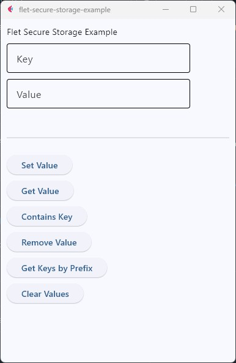

### Setting a Value
---
1. Input:
    * Key
    * Value
2. Click [Set Value] Button
3. Output:
    * User input key and value pair

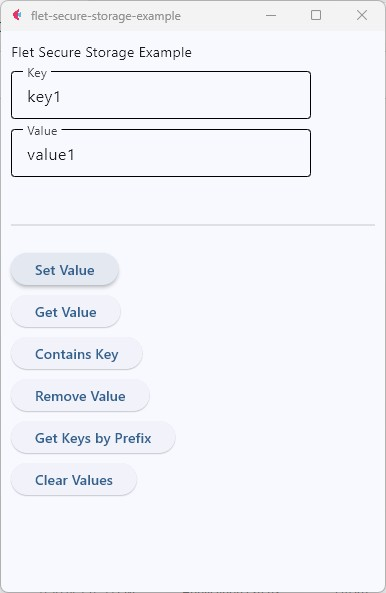
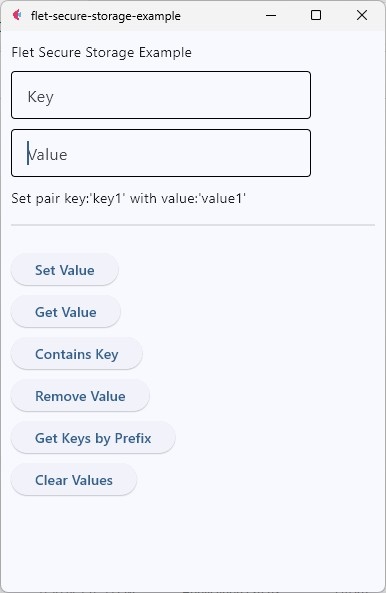

### Getting a Value
---
1. Input:
    * Key
2. Click [Get Value] Button
3. Output:
    * User input key
    * Retrieved value for key

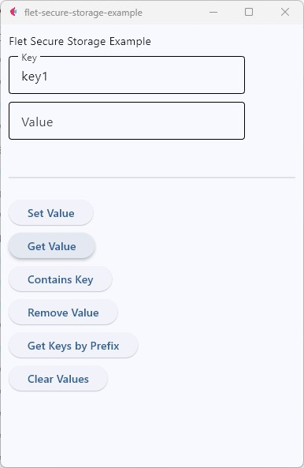
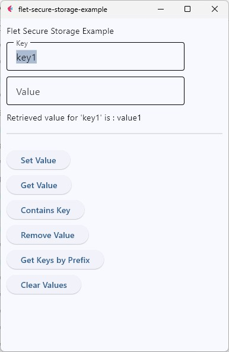

### Contains Key
1. Input:
    * Key
2. Click [Contains Key] Button
3. Output:
    * User input key
    * Boolean value if key exists

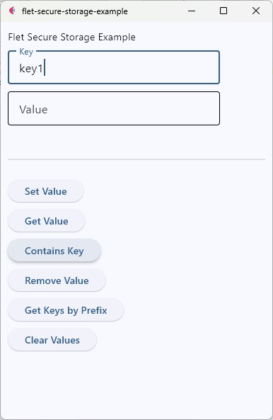
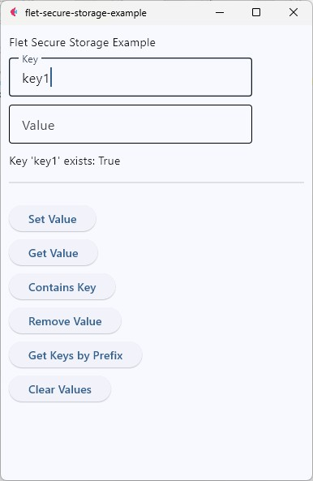

### Remove Value
1. Input:
    * Key
2. Click [Remove Value] Button
3. Output:
    * Notification that the value was removed for the user input key

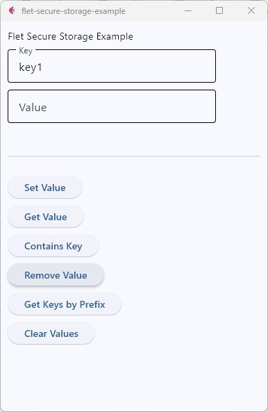
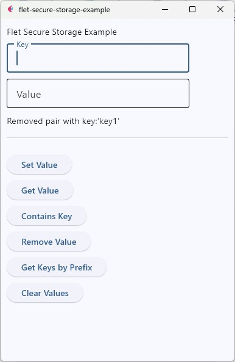

### Getting a Key by Prefix
1. Input:
    * Key (first portion of key or blank for all keys)
2. Click [Get Keys by Prefix] Button
3. Output:
    * List of all key:value pairs that start with user input prefix

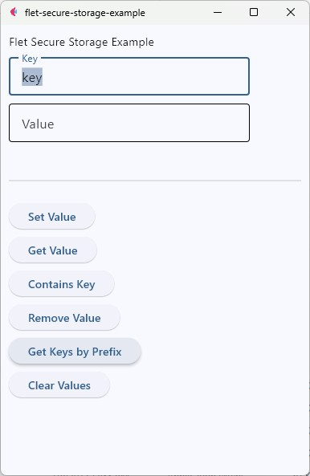
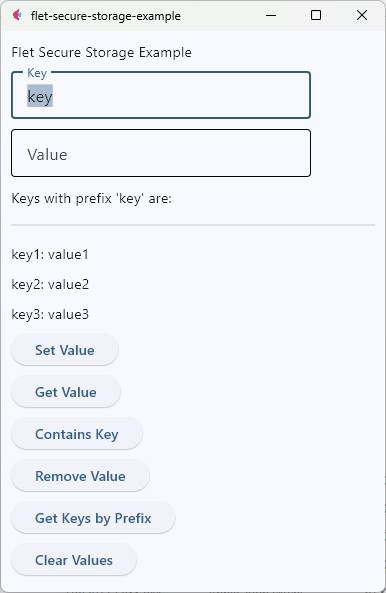

### Clear Values
1. Input:
    * None
2. Click [Clear Values] Button
3. Output:
    * Notification that all keys were removed.

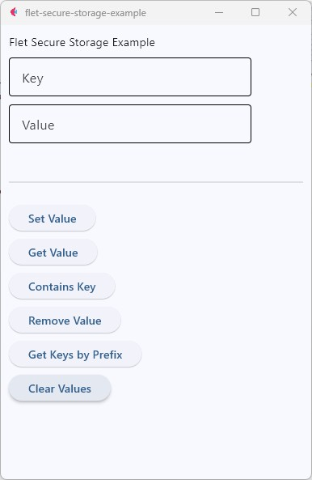
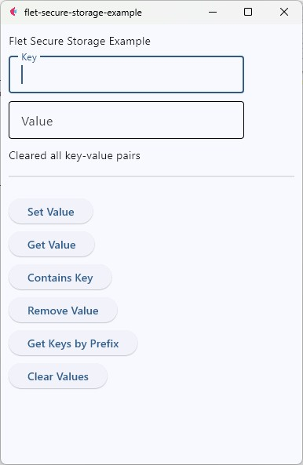